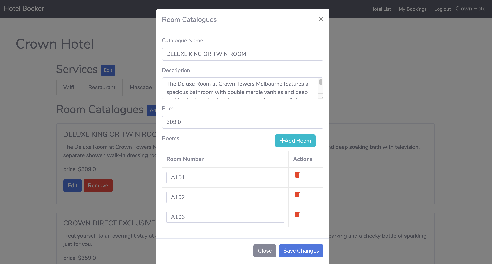
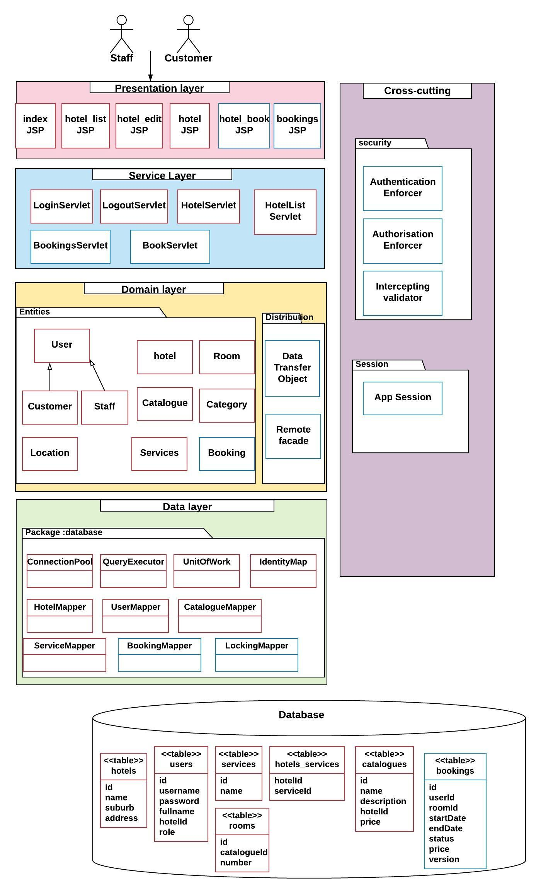

# Booker - Room Reservation System
[Heroku Demo Link](https://hotel-booker.herokuapp.com/)

Booker is a demonstration web app to showcase software architecture design and pattern implementation for modern enterprise systems.  
Its 2 features provide room reservation capabilities for the customers and reservation management capabilities to the hotel staff.   

## Screenshots
staff editing hotel information
  
  
customer making room booking

## Patterns Used
This system used the following design patterns, the links show where are they implemented.  
* domain logic layer  
`domain model`: [domain/](https://github.com/mchozhang/RoomBookingSystem/tree/master/src/main/java/com/booker/domain)  
`service layer`: [servlet/](https://github.com/mchozhang/RoomBookingSystem/tree/master/src/main/java/com/booker/servlet)  
* architectural design for data-source layer  
`data mapper`: [database/DataMapper.java](https://github.com/mchozhang/RoomBookingSystem/blob/master/src/main/java/com/booker/database/DataMapper.java)  
* object-to-relational behavioural design  
`unit of work`: [database/UnitOfWork.java](https://github.com/mchozhang/RoomBookingSystem/blob/master/src/main/java/com/booker/database/UnitOfWork.java)  
`identityMap`: [IdentityMap.java](https://github.com/mchozhang/RoomBookingSystem/blob/master/src/main/java/com/booker/database/IdentityMap.java)  
`lazy load`: Any domain model class, for example [Booker](https://github.com/mchozhang/RoomBookingSystem/tree/master/src/main/java/com/booker/domain/Booker.java)  
* object-to-structural design  
[database table construction sql script](https://github.com/mchozhang/RoomBookingSystem/blob/master/database_setup.sql)  
`identity field`: any tables  
`foreign key mapping`: for example, `users` table   
`association table mapping`: `services` table and `hotels` table  
`embedded value`: address info to `hotels` table  
`single table inheritance`: `users` table for both customer and staff role  
* presentation layer:  
`page controller`(pattern for input controller): any servlet, for example [BookingServlet](https://github.com/mchozhang/RoomBookingSystem/blob/master/src/main/java/com/booker/servlet/BookServlet.java)  
`template view`(pattern for view): any `.jsp` file using jsp syntax.  
* session  
`client session state`: [LoginServlet](https://github.com/mchozhang/RoomBookingSystem/blob/master/src/main/java/com/booker/servlet/LoginServlet.java)  
* database concurrency  
`optimistic offline lock`, `implicit lock`: [LockingMapper](https://github.com/mchozhang/RoomBookingSystem/blob/master/src/main/java/com/booker/database/LockingMapper.java)  
* distribution  
`data transfer object`, `remote facade`: [util/dataTransferObject/](https://github.com/mchozhang/RoomBookingSystem/tree/master/src/main/java/com/booker/util/dataTransferObject)  
* security  
`Authentication enforcer`, `Authorisation enforcer`: [util/AppSession](https://github.com/mchozhang/RoomBookingSystem/blob/master/src/main/java/com/booker/util/session/AppSession.java)  
`Intercepting validator`: [util/interceptingFilter](https://github.com/mchozhang/RoomBookingSystem/tree/master/src/main/java/com/booker/util/interceptingFilter)  

## Tech stack
* back-end framework: `JavaEE`
* front-end: `bootstrap`, `jQuery`
* database: `PostgreSql`

## Development Environment
 `java 1.8`  
 `apache-tomcat 9.0.22`  
 `apache-maven-3.6`  
 `PostgreSql`(optional)  

## High Level Design

